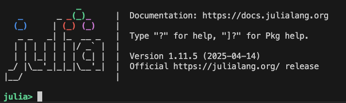
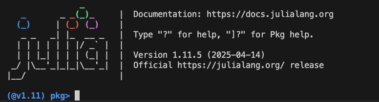

# Juliaの数値計算のTutorial

ここではJuliaの数値計算についてのTutorialを記しておく。一般的な入門書は既にいくつかあるので、ここでは特に物性物理においてGreen関数を用いて数値計算を行う用途に最適化されたTutorialとして書かれている。

まずJuliaという言語の利点について、個人的な感想を以下を挙げる。
- 環境構築が楽。(個人的にはpythonより楽だと思う。)
- pythonよりも簡単に高速化出来る
- コードを短く書けるので、バグを生み出しにくい。
- Jupyter notebookで使えるので、研究ノートの中で数値計算が出来る。(考えをまとめやすいし、他の人と議論する際に楽。数式のギリシャ文字等も標準搭載！)(最近GoogleColabにも追加されました)
- Jupyter notebookで小分けに実行できるのでデバッグも比較的簡単
- 同じコードの中でグラフを出力できる。(c++と比較)

割と万能であるように思うが、１つの数値計算で2週間とかかかるようになったら、もしかしたらもう少し早いとされるc++に切り替えた方が良いのかもしれない。
しかし、特に多くの人に対しては、コーディング＋デバッグにかかる時間を加味すると、Juliaで書いた方が早いように思う。またGoogleで検索した際に、クソみたいな"お役立ちサイト"に引っかかる確率が低く、割とそれぞれのサイトの質が高いのも利点だと思う(Pythonに比べて。Pythonの方は、最近だとChatGPTに聞くと割と良いサンプルコードを書いてくれるのでその点では改善されている。)
個人的な意見だが、今のJuliaコミュニティの拡大の仕方を見るに、5年後(2027年)くらいにはJuliaが数値シミュレーション業界では主流になるのではないかと思っているので、学部生・M1の方は是非Juliaから始めてみて欲しい。(3.5年後時点で実際にかなり主流がJuliaに移っていると思います)

## 前準備
Juliaをインストールしましょう。JuliaにはJuliaupという公式のバージョン管理ツールがあります。これ一択です。
[公式のサイト](https://github.com/JuliaLang/juliaup)より、自身の使っているOSに合わせてインストールしましょう。

公式のコピペになりますが、Windowsの場合CommandLineで以下を実行
```
winget install --name Julia --id 9NJNWW8PVKMN -e -s msstore
```

Mac/Linuxの場合、terminal/端末で以下を実行
```
curl -fsSL https://install.julialang.org | sh
```
**インストールが終わった際に、画面に表示されているpathを通すためのコマンドを実行**したらJuliaを動かすための準備完了である。
早速terminalに `julia` と打ち込んでみると以下のようにjuliaが起動する



次にライブラリを追加していこう。Juliaではライブラリ間のバージョン管理は自動的に行なってくれる。

上の画面で `]`を押してみよう。するとパッケージモードに移行する(back spaceを押せば通常のモードに戻る。)



このパッケージモードで、今後使うであろうライブラリを複数追加しておこう

```
add LinearAlgebra Plots CSV DataFrames IJulia
```

またJupyterNotebookでPlotsを利用するためには、パッケージモードで

```
build
```

を実行しておこう。これでjupyter notebookでjuliaが使えるようになっているはずだ。

物性の数値計算でよく使うものは、`LinearAlgebra`(数値計算で必須),`IJulia`(Jupyter Notebookでjuliaを使うのに必要),`Plots`(描画に必要), `DataFrames`,`CSV`(`DataFrames`と合わせて数値計算結果のデータとして保存するのに必要)あたりかと思う。
他には、機械学習などの研究には`Flux`,`BSON`などを使うし、強相関電子系の研究には`ITensor`(テンソルネットワークを用いた計算に必要),`SparseIR`(松原グリーン関数を用いた数値計算で便利)などを入れておくと良い。
tutorial3の最後まで読めば、`ITensor`以外全部使います。